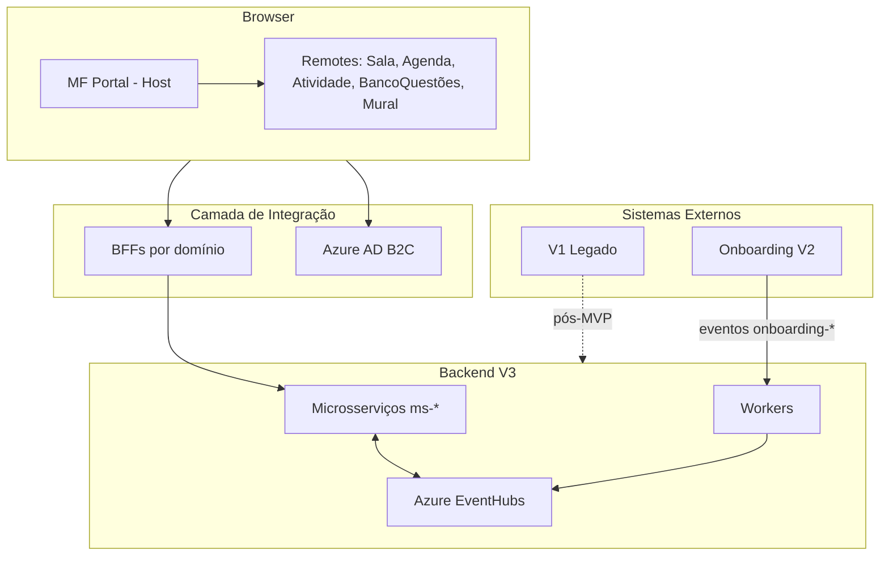

# ARCHITECTURE.md — Software Design Document | FTD Aceleração Iônica V3

**Living Architecture Document**  
Versão inicial — Julho/2026  
Foco principal: Frontend + visão geral fim-a-fim

---

## 1. Visão Geral do Sistema

A **Iônica V3** é a nova versão do LMS da FTD Educação. Ela está sendo construída para substituir gradualmente a V1, consumindo dados do **Onboarding V2** via eventos.

O sistema é composto por:
- **Frontend**: Microfrontends (Module Federation)
- **BFF Layer**: Um BFF por domínio
- **Backend**: Microsserviços (`ms-*`) + Workers (`worker-*`)
- **Mensageria**: Azure EventHubs
- **Autenticação**: Azure AD B2C

### Context Diagram (simplificado)

---

## 2. Arquitetura Frontend

### 2.1 Stack Principal (Stack Novo)

| Item              | Tecnologia                                      |
|-------------------|-------------------------------------------------|
| Build             | Rsbuild + Rspack                                |
| Framework         | React 18 + TypeScript                           |
| Composição        | Module Federation (`@module-federation/rsbuild-plugin` 0.19.1) |
| Roteamento        | react-router-dom 7                              |
| Estado            | Heterogêneo (Zustand + TanStack Query + Redux Toolkit) |
| Estilização       | Tailwind + styled-components (+ Sass em alguns) |
| Design System     | `lib-ftd-ionica-react_ions-facade` + `@ionica/ions-ds` |
| Auth              | Azure AD B2C via `lib-ftd-ionica-react_toolkit` |
| Observabilidade   | Datadog RUM (via toolkit)                       |

### 2.2 Microfrontends

| Repo                        | Papel                          | Observação                          |
|----------------------------|--------------------------------|-------------------------------------|
| `mfe-ftd-ionica_portal`    | Host                           | Consome os remotes                  |
| `mfe-ftd-ionica_sala`      | Remote principal               | Consome Mural + Atividade           |
| `mfe-ftd-ionica_agenda`    | Remote                         |                                     |
| `mfe-ftd-ionica_atividade` | Remote                         | Consome Banco de Questões           |
| `mfe-ftd-ionica_bancoquestao` | Remote                      |                                     |
| `mfe-ftd-ionica_mural`     | Remote                         |                                     |
| `mfe-ftd-ionica_login`     | App separado (stack antiga)    | Nx + Webpack                        |
| `fe-ftd-ionica-monolithic` | Legado                         | Nx, sem Module Federation           |

**Padrão de composição:**
- Host (`portal`) carrega remotes via `remoteEntry.js`
- Existe mesh entre remotes (Sala → Mural/Atividade, Atividade → Banco)
- Exposes são granulares (por persona ou use-case)

### 2.3 Heterogeneidade (débito da war room)

O projeto nasceu de uma "war room" com agência externa. Isso gerou:
- Estado gerenciado de formas diferentes entre MFEs
- Cliente HTTP inconsistente (axios vs fetch + TanStack)
- Versões divergentes de libs compartilhadas
- Zero testes automatizados no stack novo
- Ferramental de qualidade (Prettier, husky, commitlint) só no stack antigo

Esses débitos são **herança**, não decisão consciente atual.

---

## 3. Integração com Backend

### 3.1 Padrão de comunicação
- **1 BFF por domínio** (sala, agenda, atividade, bancoquestao, mural...)
- Chamadas passam por **Azure APIM**
- Header obrigatório: `Ocp-Apim-Subscription-Key`
- Token injetado via interceptor (`Authorization: Bearer`)

### 3.2 Autenticação
- Azure AD B2C
- Stack novo: via `lib-ftd-ionica-react_toolkit` (MSAL embutido)
- Token espelhado em `sessionStorage` (`@ionica-v3/msal-token`)
- Existem 3 implementações diferentes de auth no codebase (legado + novo)

### 3.3 Realtime
- SignalR via BFF de Sala
- Token de conexão obtido em `POST /sala/v1/signalr/token`
- Usado atualmente para progresso de importação de Aulas Prontas

### 3.4 Eventos
- O Frontend **não** consome EventHubs diretamente
- Comunicação assíncrona acontece no backend (Onboarding V2 → Workers → V3)

---

## 4. Decisões Arquiteturais Importantes

| Decisão                        | Status          | Comentário                                      |
|-------------------------------|-----------------|-------------------------------------------------|
| Module Federation em runtime  | Adotado         | Escolha correta para o tamanho do produto       |
| Strangler Fig (V1 → V3)       | Em andamento    | Migração gradual                                |
| Event-driven com Onboarding V2| Adotado         | Workers consomem eventos `onboarding-*`         |
| Stack poliglota no backend    | Realidade       | Java + Node convivem                            |
| Design System via facade      | Em evolução     | `ions-facade` ainda não está 100% maduro        |
| Estado heterogêneo            | Débito          | Precisa de alinhamento futuro                   |

---

## 5. Princípios de Trabalho (Frontend)

- **Reconhecimento antes de implementação** (sempre)
- Preferir **clonar padrões existentes** em vez de criar novos
- **Facade-first**: usar `lib-ftd-ionica-react_ions-facade` antes de criar componentes
- Manter mudanças em fatias pequenas e validadas
- Documentar decisões relevantes em ADR quando necessário

---

## 6. Próximos passos deste documento

- [ ] Adicionar diagramas C4 mais detalhados (Container + Component)
- [ ] Documentar contratos principais dos BFFs
- [ ] Criar ADRs para decisões críticas (ex: estratégia de estado, Module Federation)
- [ ] Expandir seção de Non-Functional Requirements
- [ ] Mapear melhor a relação entre MFEs e microsserviços

---

**Este documento é vivo.** Atualize sempre que houver mudança relevante de arquitetura ou descoberta importante.
