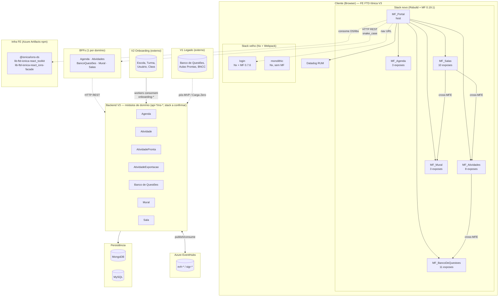

# Onboarding Frontend — Aceleração Iônica (v3)

> Documento construído em **6 passadas** (mai/2026): a passada 1 leu a wiki `.md` do projeto; as passadas 2-5 leram o **código** dos 8 repos de frontend; a passada 6 consolidou. A maior parte do conteúdo hoje tem base em código — a wiki é citada onde ainda é a única fonte. Cada afirmação carrega seu status epistêmico (**FATO** verificado no código, **HIPÓTESE**, ou wiki não confirmada); gaps e perguntas abertas ficam na Seção 9.
>
> Onboarding existente em `Aceleração-iônica/🎒-Onboarding.md` é institucional (boas-vindas, credenciais HML, planilha de férias) e **não cobre nada técnico** — este doc estende, não duplica.

---

## 0. Contexto histórico do projeto

Origem (relatado em kickoff por Macha/coordenador — **não está em wiki, sujeito a revisão com TL/Arquiteto**):

- V3 foi inicialmente construída por **agência externa**.
- Agência atrasou. Pra cumprir prazo, virou **"war room"**: cada dev pegou um MFE e construiu em paralelo, sem coordenação técnica forte.
- Entrega aconteceu **atrasada e com bugs**.
- V3 está **em produção atualmente, mas instável**.
- Decisão estratégica: **descontinuar agência, montar time interno**.
- Time atual: TL + Arquiteto + 2 FE + 2 BE + QA + PO + SM.
- Esse time agora **absorve a V3** — eu entro aqui.

### Implicação na leitura do código

Várias estranhezas do código provavelmente são **consequência da war room**, não decisão arquitetural consciente:

- Stack heterogênea entre MFEs (Redux vs Zustand vs ambos).
- HTTP client inconsistente (axios em alguns, fetch em outros).
- Mismatch de versão em singleton (`lib-ftd-ionica-react_toolkit@0.0.13` em Sala vs `1.0.3` no portal).
- Names errados em `package.json` (copy-paste apressado).
- Zero testes em todos os MFEs novos.
- CSS injection conhecido com workaround `!important`.
- Mesh entre MFEs (Atividades→Banco, Salas→Mural+Atividades) sem rastreamento formal de consumers.

### Recalibração: hipótese A vs B

Hipótese A (decisão consciente de descartar ferramental) vs hipótese B (débito não-priorizado): resposta provável é **predominantemente B, com origem específica em pressão de prazo da agência**.

**Implicação política:** propor reintrodução de ferramental (testes, husky, commitlint) provavelmente NÃO bate de frente com cultura, mas com falta de tempo. Negociação diferente.

### Para ter no radar

- Macha mencionou no kickoff "algo técnico que não gostou" no projeto — detalhe não anotado. Vale recuperar em conversa informal antes de propor mudanças arquiteturais.

---

## 1. O que é o projeto

A **Iônica** é a plataforma educacional da FTD (`ola.souionica.com.br`). O time
**Aceleração Iônica** está construindo a **versão 3.0** — um LMS que substitui a V1 e
integra com o Onboarding V2. (fonte: `Aceleração-iônica.md` → "Visão do produto")

- **Valor**: LMS que integra ensino físico e digital — conteúdo curricular FTD,
  criação/curadoria de aulas, mural de turma, atividades e banco de questões.
- **Usuários**: professores, gestores e alunos de escolas FTD (confirmado pelo dev;
  bate com a wiki). Credenciais de homolog em `🎒-Onboarding.md`.

### As três versões coexistindo

| Versão | O que é | Status |
|--------|---------|--------|
| **V1** (`souionica.com.br`) | LMS legado — banco de questões, aulas prontas, atividades prontas, classificações (BNCC, ano/série, componente curricular). *Definição da wiki; o papel exato em produção hoje não foi reconfirmado nesta passada.* | Em produção |
| **V2 — Onboarding** | Sistema de provisionamento: sincroniza Escola / Ano / Turma / Usuário / Sala via UP-INSERT e dispara eventos `onboarding-*` que a V3 consome para montar suas entidades. O padrão "Ensino Superior" é ignorado no fluxo. *(relato do dev — não verificado em código nesta passada)* | Ativo, alimentando a V3 |
| **V3 — Aceleração Iônica** | A nova plataforma, foco deste time (ver módulos na Seção 4 e glossário na Seção 7). | Em construção; em produção iterativa e instável — ver Seção 0 |

A interoperabilidade **V1 ↔ V3** fica **pós-MVP** (ver Seção 7 → glossário; wiki
`CDC-%2D-Interoperabilidade-v1.md.md`).

### Estado e contexto

- **Cronograma**: o MVP foi planejado para o 2º semestre de 2025 (Sprint 28 referenciada
  em out/2025). Em mai/2026 a V3 já está em produção iterativa — mas **instável**. O
  histórico de como se chegou aqui (agência externa → war room → time interno assumindo)
  está na **Seção 0**, leitura recomendada antes de propor mudanças.
- **Time**: dois squads ("Time 1" e "Time 2") em paralelo no mesmo produto — composição
  detalhada na Seção 0.
- **Arquitetura**: stack de microfrontends (host + remotes + monolítico legado), Module
  Federation — ver **Seção 2**.

### Em aberto (pendente de confirmação com o time)

- **Posicionamento estratégico**: a Iônica é vendida atrelada ao material didático FTD
  ou é produto standalone? A V3 vai **substituir** a V1 por completo ou as duas coexistem
  em definitivo? Qual o driver de negócio da V3 (modernização técnica, função nova,
  exigência de cliente)? — não confirmado (ver Seção 9).
- **Escala** (nº de escolas / alunos / professores) — não levantado (ver Seção 9).

---

## 2. Arquitetura em uma página

> ⚠️ Diagramas oficiais C4 (`Arquitetura-Aceleração-Iônica.md` referencia 5 SVGs em `.attachments/`) ainda **não foram lidos** (binários). Diagrama abaixo veio da leitura do código FE (passada 2 — 2026-05-14): monolítico + portal em profundidade, 5 remotes + login em varredura rasa. Linhas tracejadas = inferido ou comunicação por URL/HTTP.



**Legenda:**
- Seta sólida dentro de `Client` = composição via Module Federation (host consome remote em runtime).
- Seta tracejada = navegação por URL ou comunicação HTTP.
- Setas saindo do `PORTAL` pra `Infra`/`BFFs` representam o padrão de **todos** os MFEs do stack novo (cada um consome DS via npm e seu BFF de domínio). Desenhado a partir do portal só pra reduzir poluição visual.
- **Não desenhados**: 4 repos placeholder vazios (`mfe-ftd-ionica_{assets,boilerplate,componentes,home}`) e 8 apps externos navegados por URL (perfil, licencas, biblioteca, relatorios, administracao_base, literatura, labs, home). Ver subseção abaixo.

### Microfrontends identificados

**Atualizado em 2026-05-14** com evidência da leitura do código FE (passada 2).

### FATO

- **12 repos no workspace FE** (em `D:\local\ftd\ftd-frontend\`): 1 monolítico + 1 host + 5 remotes domínio + 1 login standalone + 4 placeholders vazios no Azure DevOps. **8 estão populados** (os 4 placeholders, vazios). Convenção de contagem usada neste doc: "**7 repos `mfe-*`**" = os 7 com prefixo `mfe-` (exclui `fe-ftd-ionica-monolithic`); "**8 repos populados**" inclui também o `monolithic`.
- **Composição em runtime**: **Module Federation** via `@module-federation/rsbuild-plugin@0.19.1`, host `MF_Portal`. Discovery dos remotes por env var (`PUBLIC_URL_MFE_*/remoteEntry.js`) injetada no build (rsbuild `source.define`).
- **5 remotes domínio**: `MF_Agenda` (3 exposes), `MF_Atividades` (8), `MF_BancoDeQuestoes` (11), `MF_Mural` (3), `MF_Salas` (10 + `./hooks`).
- **Topologia mesh, não estrela**: Atividades consome BancoDeQuestoes; Salas consome Mural + Atividades. Cada remote pode também ser host — acoplamento horizontal entre domínios.
- **`mfe-ftd-ionica_login` NÃO é remote do portal**: stack diferente (Nx + Webpack + MF `0.7.6`), provavelmente navegado por URL. README do portal cita "SSO através do Iônica 1.0" — login é provável bridge com o legado.
- **`fe-ftd-ionica-monolithic` NÃO usa Module Federation**: app Nx puro, sem `@module-federation/*` deps. App "do mundo velho", standalone.
- **Infraestrutura compartilhada PUBLICADA** em Azure Artifacts feed `ions-ds` (visível em `.npmrc` dos repos): `@ionica/ions-ds@2.6.1` (DS), `lib-ftd-ionica-react_toolkit` (helpers/auth), `lib-ftd-ionica-react_ions-facade` (facade do DS — nome "Ions" mapeia pra "SubAtomic" do Atomic Design da wiki). Consumida via npm, não por submodule/path-mapping.
- **8 apps externos navegados por URL** (env vars no portal `rsbuild.config`): home, perfil, licencas, biblioteca, relatorios, administracao_base, literatura, labs. **Não estão no workspace local** — sistema é maior que os 12 repos clonados.

### Mapa atual

| Repo | Status | Stack | Papel |
|------|--------|-------|-------|
| `mfe-ftd-ionica_portal` | populado | Rsbuild + MF 0.19.1 | **Host** — consome 5 remotes |
| `mfe-ftd-ionica_agenda` | populado | Rsbuild + MF 0.19.1 | Remote — Agenda V3 |
| `mfe-ftd-ionica_atividade` | populado | Rsbuild + MF 0.19.1 | Remote — Atividade V3 (consome Banco) |
| `mfe-ftd-ionica_bancoquestao` | populado | Rsbuild + MF 0.19.1 | Remote — Banco de Questões V3 |
| `mfe-ftd-ionica_mural` | populado | Rsbuild + MF 0.19.1 | Remote — Mural V3 |
| `mfe-ftd-ionica_sala` | populado | Rsbuild + MF 0.19.1 | Remote — Sala V3 (consome Mural + Atividade) |
| `mfe-ftd-ionica_login` | populado | Nx + Webpack + MF 0.7.6 | App "velho", navegado por URL — bridge auth |
| `fe-ftd-ionica-monolithic` | populado | Nx + Webpack, **sem MF** | App "velho" standalone — papel residual a confirmar |
| `mfe-ftd-ionica_assets` | **vazio** (Azure DevOps) | — | Placeholder; intenção: assets compartilhados |
| `mfe-ftd-ionica_boilerplate` | **vazio** (Azure DevOps) | — | Placeholder; intenção: template novos MFEs |
| `mfe-ftd-ionica_componentes` | **vazio** (Azure DevOps) | — | Placeholder; **provavelmente dead-letter** — DS já está em Azure Artifacts |
| `mfe-ftd-ionica_home` | **vazio** (Azure DevOps) | — | Placeholder; env `PUBLIC_URL_HOME` existe — futuro dashboard/landing |

### Exposes por MFE (contrato remote → host)

Grão de exposição é fino — **não "1 app por MFE"**. Cada remote expõe múltiplos módulos nomeados:

| MFE | Qtd. | Pattern de exposição |
|-----|------|---------------------|
| Agenda | 3 | Por **persona**: `./AgendaProfessor`, `./AgendaEstudante`, `./AgendaGestor` |
| Atividades | 8 | Por **use-case**: Criar, Hub (Prof/Est), Correção, Responder, Modelos, Redirecionar, PreviewQuestões |
| BancoDeQuestoes | 11 | App + Mini + 5 pares `ModalLateral*` + `*Actions` — **componentes UI separados de action handlers** (granularidade funcional) |
| Mural | 3 | Por persona + `./Postagem` |
| Salas | 10 + 1 | Persona × use-case + `./hooks` (compartilha hooks customizados com outros MFEs!) |

### HIPÓTESES (a validar)

**Padrão arquitetural emergente: Strangler Fig com execução caótica** — o monolítico está sendo desmembrado em MFEs (padrão clássico de modernização), mas a execução durante a war room (ver Seção 0) foi sem coordenação formal. Resultado: migração no caminho certo arquiteturalmente, mas com débitos significativos de uniformidade e qualidade herdados da pressão de prazo. As hipóteses abaixo são desdobramentos desse cenário.

- **Dois mundos convivendo**: stack "novo" (Rsbuild + MF 0.19.1) e stack "velho" (Nx + Webpack + MF 0.7.6 ou sem MF). Trajetória provável: monolítico → splittado em MFEs no Rsbuild durante war room → login ficou no stack antigo por ser caminho de entrada com bridge SSO crítico (ninguém quis mexer).
- **Heterogeneidade entre remotes (state, HTTP, deps), mismatch de versão em singleton e names errados em `package.json`** são consequências diretas da war room — cada MFE foi feito por dev/dupla diferente sem unificação prévia. Copy-paste apressado entre repos confirma o padrão (`agenda` declarando `name: atividade`; `monolithic` declarando `name: login`). Ver Seção 4 para fatos verificáveis.
- **Placeholder `componentes` é dead-letter**: DS já é `@ionica/ions-ds` em Azure Artifacts; repo provavelmente criado **antes** do DS ser publicado e nunca limpo. **Hipótese anterior de DS duplicado entre repos está refutada** — DS é versionado e publicado.
- **Placeholder `boilerplate` é dead-letter**: pelos copy-paste artifacts entre `package.json`, equipe nunca aderiu a boilerplate formal.
- **Cross-MFE consumption** (Atividade→Banco, Sala→Mural+Atividade) indica recorte por **domínio de UX acoplado**, não por equipe/release independente. Mudar contrato de Banco afeta Atividade E Portal — coupling implícito sem rastreamento formal.
- **`mfe-ftd-ionica_login` provavelmente é mini-host Nx** internamente (scripts `nx run shell:serve:development`, `@nx/module-federation` + `@module-federation/enhanced@0.7.6` instalados). Pode ter shell + remotes próprios dentro do workspace Nx. A validar lendo `nx.json`/`project.json` numa próxima passada.

### A confirmar (próximas passadas)

- Estrutura interna do Nx workspace do login (shell + remotes próprios?).
- Bridge auth: como portal recebe estado de auth pós-SSO via login.
- Catálogo completo dos 8 apps externos (onde estão os repos? quem cuida?).
- Status real do monolítico em produção — ainda servindo tráfego ou só código histórico congelado?

---

## 3. Como os microfrontends se integram

> ⚠️ Doc textual quase ausente. Atualizado em 2026-05-14 com evidência mista (pasta de trabalho local + Azure DevOps) — ver Seção 2.

### FATO

- **MFE existe em runtime hoje** (7 repos populados, ver Seção 2).
- Auth client-side: token em `sessionStorage['@ionica-v3/msal-token']` (chave real, verificada em código — ver Seção 5 → autenticação client-side). A wiki (`👨‍💻-Frontend/Observabilidade-...md` → `DataDogSetUser`) descreve `localStorage['session']` decodificado via `jwtDecode` pra extrair `guid`/`name`/`lastname`/`email` — mas **essa chave não existe no código V3**; provável referência a V1/V2 ou doc obsoleta.
- Template de release lista HOMOLOG → PRE-PROD → PROD (fonte: `📦-Release-Notes/Release-nº-xx-%2D-xx.xx.xx.md`, em branco).

### A confirmar (Camada 1)

- ~~**Tecnologia de composição** (Module Federation? single-spa? import maps? iframe?)~~ **Respondido (passada 2):** Module Federation via `@module-federation/rsbuild-plugin` — ver Seção 2.
- **Roteamento entre MFEs** — *parcialmente:* o `copilot-instructions.md` do `portal` descreve o padrão (lazy import de `MF_*/*`, `ProtectedRoute` + layout `Master`) — ver Seção 6; o roteamento interno de cada remote segue não mapeado.
- **Contrato host↔remote**: mount function, props, lifecycle, event bus, contexto compartilhado — segue aberto (os *exposes* estão na Seção 2, mas o contrato de mount/props não foi lido).
- ~~**Mecanismo de descoberta de remotes**: URLs hardcoded, `remoteEntry.js`, manifesto, import maps.~~ **Respondido (passada 2):** env var `PUBLIC_URL_MFE_*` → `remoteEntry.js`, injetada no build — ver Seção 2.
- **Shared deps** entre host e remotes — *parcialmente:* React/ReactDOM e MSAL são singletons compartilhados via toolkit (ver Seções 5-6); o inventário completo de shared deps não foi levantado.
- ~~**Deploy**: hipótese forte de **deploy por MFE**~~ **Confirmado (passada 5):** cada MFE do stack novo tem `azure-pipelines.yaml` próprio — ver Seção 6.
- ~~**Onde mora o design system hoje**~~ **Respondido (passada 2):** publicado no Azure Artifacts (`@ionica/ions-ds`), consumido via npm — ver Seção 2. (A pergunta sobre os repos placeholder vazios segue na Seção 9 → "Infraestrutura compartilhada".)

---

## 4. Stack frontend detalhada

> ⚠️ Reescrita em 2026-05-15 (passada 3) a partir da leitura dos `package.json`,
> `package-lock.json` e da presença de configs (`rsbuild.config.ts`, `nx.json`) nos
> **8 repos populados**. A versão anterior desta seção era passada 1 (wiki-only) e
> marcava quase tudo como `gap` — a wiki segue sem documentar a stack, mas o código
> responde. Citações apontam `repo/arquivo:linha`.

Dois mundos, como na Seção 2: **stack novo** (6 MFEs em Rsbuild) e **stack velho**
(`login` + `monolithic`, Nx). A tabela abaixo é o stack novo; o velho vem depois.

### FATO — stack novo (`portal`, `agenda`, `atividade`, `bancoquestao`, `mural`, `sala`)

| Item | Valor | Fonte (exemplo) |
|------|-------|-----------------|
| **Framework** | React **18.3.1** — idêntico nos 6 | `mfe-ftd-ionica_portal/package.json:26-27` |
| **Linguagem** | TypeScript **5.9.2** | `mfe-ftd-ionica_portal/package.json:47` |
| **Build tool** | **Rsbuild 1.5.6** (`@rsbuild/core`) + `@rsbuild/plugin-react` 1.4.0. Script `"build": "rsbuild build"` | `mfe-ftd-ionica_portal/package.json:7,34-35` |
| **Framework de UI** | SPA React puro — **sem Next/Remix**. Cada MFE tem `rsbuild.config.ts` na raiz | `mfe-ftd-ionica_portal/rsbuild.config.ts` (existe) |
| **Composição MFE** | Module Federation via `@module-federation/rsbuild-plugin` **0.19.1** | `mfe-ftd-ionica_portal/package.json:18` (detalhe na Seção 2) |
| **Roteamento** | `react-router-dom` **7.9.1** | `mfe-ftd-ionica_portal/package.json:29` |
| **Gerenciador de estado** | **Heterogêneo** — Redux Toolkit, Zustand e TanStack Query convivem; ver tabela dedicada abaixo | — |
| **Estilização** | **Tailwind 3.4.17** (nos 6) + **styled-components 6.1.x** (em 5 dos 6 — `portal` é só Tailwind) + PostCSS/autoprefixer. **Sass** (`@rsbuild/plugin-sass`) só em `bancoquestao` e `sala` | `mfe-ftd-ionica_portal/package.json:39,44,46`; `mfe-ftd-ionica_bancoquestao/package.json:73` |
| **Editor rico** | **CKEditor 5** (`ckeditor5` 47.0.0 + `@ckeditor/ckeditor5-react` 9.5.0) em `portal`, `atividade`, `mural`, `sala`. **Lemonade** (`@oneclick/react-lemonade-editor` 3.38.1) em `atividade`, `bancoquestao`, `sala` | `mfe-ftd-ionica_portal/package.json:14,22`; `mfe-ftd-ionica_atividade/package.json:24` |
| **Testes** | **Zero.** Script `test` nos 6 é literalmente `echo "this project doesn't have any tests"`; nenhuma lib de teste (Jest/Vitest/Testing Library) instalada | `mfe-ftd-ionica_portal/package.json:11` |
| **Lint** | **ESLint 9.35.0** com flat config (`@eslint/js` + `typescript-eslint` 8.43.0) | `mfe-ftd-ionica_portal/package.json:33,40,48` |
| **Format** | **Prettier ausente** — nenhum `prettier` nos `devDependencies` dos 6 | (ausência em `package.json`) |
| **Git hooks** | **Nenhum** — sem `husky`/`lint-staged`/`commitlint` nos `package.json` | (ausência em `package.json`) |
| **Monorepo** | **Não.** Cada MFE é repo isolado, com seu próprio `package-lock.json` | `mfe-ftd-ionica_portal/package-lock.json` (existe, 1 por repo) |
| **Package manager** | **npm** — `package-lock.json` nos 8; `engines.npm >=10.8.2` em `bancoquestao` | `mfe-ftd-ionica_bancoquestao/package.json:9-12` |
| **Design System** | `@ionica/ions-ds` 2.6.1, consumido via facade `lib-ftd-ionica-react_ions-facade` 0.0.8 + `lib-ftd-ionica-react_toolkit` (publicados no Azure Artifacts) | `mfe-ftd-ionica_portal/package.json:23-24` |
| **Auth** | Azure AD **B2C** via `lib-ftd-ionica-react_toolkit` — a toolkit bundla `@azure/msal-browser` 4.22.1 + `@azure/msal-react` 3.0.19; token via `getIonicaAuthToken()`. Quadro completo na Seção 5 | `mfe-ftd-ionica_portal/package-lock.json:7615-7632`; `mfe-ftd-ionica_portal/src/configs/IonicaAuthConfig.ts` |

### FATO — Design System & libs React compartilhadas

A infra de UI compartilhada são três pacotes publicados no feed Azure Artifacts, consumidos via npm: `@ionica/ions-ds` (o DS), `lib-ftd-ionica-react_ions-facade` (facade do DS) e `lib-ftd-ionica-react_toolkit` (auth/observabilidade — ver Seções 5-6).

**`lib-ftd-ionica-react_ions-facade`** — analisado em 2026-05-17 (Camada 1). ⚠️ Atenção de método: a branch `main` do repo só tem o scaffold inicial; o código real está em `origin/develop` — as afirmações abaixo são de `develop`.

- **Stack:** Vite 7.1.2 (library mode, só ESM), TypeScript 5.9.2, React 18.3.1 (peer), Tailwind 3.4.17, testes Vitest. *FATO* (`package.json`, `vite.config.ts:35-52`).
- **O que exporta:** só componentes (barrel `src/index.ts` → `./components`; os hooks `useScreenSize`/`useSampleHook` existem mas **não são re-exportados** — a confirmar se intencional). Mix de: (a) re-export cru de ~19 componentes de `@ionica/ions-ds`; (b) wrappers (`IonsProvider`); (c) componentes próprios sem equivalente no DS (`BarraDePesquisa`, `Dropdown`, `Loading`, `Toast`). *FATO*.
- **Relação com `@ionica/ions-ds`:** consome como `dependency` pin exato — `@ionica/ions-ds@2.15.1` em `develop`. CSS do DS re-exposto como `dist/ions.css`; tipos do DS embutidos no `.d.ts` publicado. Nome "Ions" mapeia pra camada **SubAtomic** do Atomic Design. *FATO*.
- **Relação com `lib-ftd-ionica-react_toolkit`:** **nenhuma** — o facade não depende do toolkit; são libs irmãs, consumidas lado a lado. *FATO*.
- **Publicação:** feed Azure Artifacts privado (`ionica-v3`), patch auto-incrementado pelo pipeline. O README anuncia um pacote npm público `@ftd/...` que **não corresponde** à publicação real — não usar o README como fonte. *Atenção*.
- **A confirmar — drift de versão:** o `portal` declara `ions-facade 0.0.8` e `@ionica/ions-ds 2.6.1` (tabela acima), enquanto o repo do facade em `develop` está em `0.0.7` consumindo `ions-ds 2.15.1`. Há defasagem entre o que o portal consome e o estado atual do facade.

### FATO — gerenciamento de estado (o caos heterogêneo, quantificado)

Versões lidas direto de cada `package.json`. "—" = não declarado como dependência.

| Repo | Redux Toolkit | Zustand | TanStack Query | redux-persist |
|------|---------------|---------|----------------|---------------|
| `portal` | 2.9.2 | — | 5.87.4 | — |
| `agenda` | — | 5.0.4 | 5.87.4 | — |
| `atividade` | — | 5.0.4 | 5.87.4 | — |
| `bancoquestao` | 2.8.2 | 5.0.6 | **— (sem TanStack)** | 6.0.0 |
| `mural` | 2.3.0 | 5.0.4 | 5.87.4 | — |
| `sala` | 2.3.0 | 5.0.4 | 5.87.4 | 6.0.0 |
| `login` | 2.3.0 | 5.0.4 | 5.83.0 | 6.0.0 |
| `monolithic` | 2.3.0 | 5.0.4 | 5.83.0 | 6.0.0 |

Citações: `portal/package.json:19,20`; `agenda/package.json:28,34`; `atividade/package.json:26,34`;
`bancoquestao/package.json:39,60,65`; `mural/package.json:23,24,33`; `sala/package.json:28,29,50,55`;
`login/package.json:48,49,73,78`; `monolithic/package.json:52,56,79,84`.

**Leitura:** 5 dos 8 repos (`bancoquestao`, `mural`, `sala`, `login`, `monolithic`)
carregam **Redux e Zustand ao mesmo tempo**. `portal` é só Redux; `agenda` e
`atividade` são só Zustand. Não há um "jeito do time" — cada MFE escolheu o seu.

### FATO — cliente HTTP / data fetching

| Repo | axios | TanStack Query |
|------|-------|----------------|
| `portal`, `agenda`, `atividade`, `mural` | — | sim |
| `bancoquestao` | 1.10.0 | — |
| `sala` | 1.11.0 | sim |
| `login`, `monolithic` | 1.11.0 | sim |

Citações: `bancoquestao/package.json:40`; `sala/package.json:30`; `login/package.json:50`;
`monolithic/package.json:57`.

### FATO — stack velho (`login`, `monolithic`)

| Item | `mfe-ftd-ionica_login` | `fe-ftd-ionica-monolithic` |
|------|------------------------|----------------------------|
| **Build** | Nx **21.3.10** + Webpack | Nx **21.6.2** + Webpack |
| **Module Federation** | `@module-federation/enhanced` **0.7.6** + `@nx/module-federation` | **Nenhum** — sem `@nx/module-federation`, sem `@module-federation/*` |
| **Linguagem** | TypeScript **5.8.3** | TypeScript **5.8.3** |
| **Roteamento** | `react-router-dom` **6.28.2** | `react-router-dom` **6.28.2** |
| **Auth** | Azure AD **B2C** via OAuth2 redirect cru — **sem lib MSAL** (config em `.env.example`) | **`@azure/msal-browser` 4.18.0 + `@azure/msal-react` 3.0.16** (Azure AD) — 3 implementações na Seção 5 |
| **Testes** | Jest 30 + Testing Library **instalados**, mas script `test` ainda é `echo "...no tests"` | idem |
| **Format** | **Prettier 3.4.2** + `eslint-config-prettier` + `prettier-plugin-tailwindcss` | idem |
| **Git hooks** | **husky 9.1.7 + lint-staged + commitlint** (`config-conventional`) + **git-branch-validator** | idem |
| **Node** | `engines: node >=22.8.0 <23` | `engines: node >=22.8.0 <23` |

Citações: `mfe-ftd-ionica_login/package.json:86,91,129,138,141,149,176-205`;
`fe-ftd-ionica-monolithic/package.json:8-11,37-38,125,134,137,145,175`;
auth do `login`: `mfe-ftd-ionica_login/.env.example:4-7` +
`mfe-ftd-ionica_login/apps/shell/src/pages/Token.tsx:28`.
Ausência de MF no monolithic: não há `@nx/module-federation` nem `@module-federation/*`
em `fe-ftd-ionica-monolithic/package.json` (devDeps lidos integralmente).

### FATO — artefatos de copy-paste em `package.json`

(A Seção 2 aponta isto e remete a esta seção para os fatos verificáveis.)

- `mfe-ftd-ionica_agenda` declara `"name": "mfe-ftd-ionica_atividade"` — `mfe-ftd-ionica_agenda/package.json:2`.
- `fe-ftd-ionica-monolithic` declara `"name": "fe-ftd-ionica_login"` e
  `"description": "...módulo de LOGIN..."` — `fe-ftd-ionica-monolithic/package.json:2,4`.
- `mfe-ftd-ionica_login` declara `"name": "fe-ftd-ionica_login"` — prefixo `fe-` no
  campo `name` vs. `mfe-` no nome do diretório/repo — `mfe-ftd-ionica_login/package.json:2`.
- Mismatch de versão de singleton: `sala` consome `lib-ftd-ionica-react_toolkit@0.0.13`
  enquanto os demais usam `1.0.3` — `mfe-ftd-ionica_sala/package.json:79`.

### HIPÓTESES (a validar)

- **Estado heterogêneo confirma a war room (Seção 0).** Redux + Zustand juntos no mesmo
  repo (5 dos 8) sugere migração incompleta Redux→Zustand, ou uso paralelo sem critério.
  A confirmar lendo onde cada store é instanciado.
- **`portal`/`agenda`/`atividade`/`mural` não têm cliente HTTP explícito.** Sem `axios`
  nem outro client → provavelmente `fetch` nativo por baixo do TanStack Query. A confirmar.
- **`bancoquestao` usa só `axios`, sem TanStack Query nem outro data-fetching layer.**
  Implica gerenciamento manual de cache/loading/error em cada chamada. A confirmar se
  é decisão consciente ou herança da war room.
- **Sass (`@rsbuild/plugin-sass`) está em `bancoquestao` e `sala` apenas**, não nos
  outros 4 MFEs do stack novo. A confirmar: herança de código com `.scss` do monolítico
  durante a extração? Preferência dos devs? Exigência de componentes específicos do DS?
  Vale saber o critério pra não criar `.scss` em outros MFEs sem entender o porquê.
- **Datadog RUM — CONFIRMADO na V3** (passada 4, 2026-05-15). A hipótese de estar
  **embutido na toolkit interna** se confirmou: `@datadog/browser-rum` 6.24.1 vem bundled na
  `lib-ftd-ionica-react_toolkit@1.0.3` (`mfe-ftd-ionica_portal/package-lock.json:7615-7632`)
  — por isso não estava nos 8 `package.json`. Instrumentado no portal (host) via
  `IonicaMonitorProvider`. Config, sample rate real (5%, não 20%) e env vars na
  Seção 5 → observabilidade.
- **Auth: três implementações, todas Azure AD B2C** — confirmado na passada 4; quadro
  completo na Seção 5 → autenticação client-side. (1) Stack novo (portal + 5 MFEs)
  autentica via `lib-ftd-ionica-react_toolkit`, que bundla `@azure/msal-*`
  (`mfe-ftd-ionica_portal/package-lock.json:7615-7632`). (2) `monolithic` usa MSAL
  próprio (`@azure/msal-browser`/`@azure/msal-react` direto, módulo local
  `apps/shell/src/utils/IonicaAuth/`). (3) `login` faz OAuth2 redirect cru, sem lib
  MSAL — porque delega a auth pro `bff-ftd-ionica_login` (padrão BFF-auth), o que pode
  torná-la a implementação mais correta das três, não a pior. Heterogeneidade provável
  da war room; quadro completo e fontes na Seção 5.
- **Ferramental de qualidade (Prettier, husky, commitlint, branch-validator) só existe
  no stack velho (Nx).** Não foi portado para os MFEs Rsbuild. Reforça a hipótese B da
  Seção 0: o time *tinha* o ferramental e o perdeu na migração apressada — débito por
  pressa, não decisão consciente de descartar.
- **"Lemonade"** (mistério do glossário, Seção 7): `@oneclick/react-lemonade-editor` é
  um editor de questões npm de terceiro (escopo `@oneclick`). O
  `Lemonade-Json-vs-Relacional.md` da wiki provavelmente trata do formato JSON desse editor.

### A confirmar (próximas passadas)

- Onde Redux vs. Zustand são de fato usados em cada repo (store global vs. estado local).
- Cliente HTTP real de `portal`/`agenda`/`atividade`/`mural` (fetch puro? wrapper na toolkit?).
- Drift de versão entre stacks: React igual (18.3.1), mas TS 5.9.2 (novo) vs 5.8.3
  (velho), `react-router-dom` 7.9.1 vs 6.28.2 — intencional ou só falta de bump?
- CKEditor em três versões: `ckeditor5` 47.0.0 (stack novo), `ckeditor5-build-classic`
  41.4.2 (`login`), `ckeditor5` 46.0.0 (`monolithic`). Plano de unificação?

### Documentado na wiki, não verificável no código nesta passada

Itens que vêm da wiki (`Aceleração-iônica.md`) e não dá para confirmar pelos
`package.json`/configs. Ficam registrados aqui — sem promessa de cobertura em
alguma outra seção que ainda não existe:

- **Analytics de produto**: Google Analytics, Hotjar, PowerBI.
- **Design System** publicado externamente no [Zeroheight](https://zeroheight.com/813ec1e30/p/914d22-design-tokens) (design tokens).
- **Figma**: projeto FTD compartilhado (link no `Aceleração-iônica.md`).

(**Atomic Design bilíngue** e **convenção de IDs `kebab-case`** — também wiki-only
na Seção 4 antiga — não entram neste bloco porque já estão cobertos na **Seção 6 →
"Documentado na wiki — NÃO confirmado no código"**.)

### Mapa pessoal: o que você já domina vs. o que é novo

- **Confortável (você já manja):** React 18, TypeScript, Tailwind, styled-components,
  Redux Toolkit, TanStack Query, react-router, Atomic Design, design systems.
- **Provavelmente novo / vale estudar:** **Module Federation em runtime** (plugin
  Rsbuild) — domínio de aprendiz declarado; **Rsbuild** como build tool (Rspack por
  baixo) se você vinha de Vite/Webpack; **Zustand**, se não usou; a coexistência de
  dois build systems (Rsbuild novo + Nx velho).
- **Atenção no projeto (não é skill, é estado do código):** não existe um padrão único
  de estado entre os MFEs; **zero testes** rodando em qualquer repo; **sem Prettier no
  stack novo** → formatação tende a divergir entre arquivos e entre devs.
- **Domínio (negócio):** terminologia Iônica (Sala, Turma, Mural, Aula Pronta, Atividade
  Pronta, Conteúdo Próprio, Objeto Digital, Componente Curricular, BNCC) — estude antes
  da primeira reunião.

---

## 5. Pontos de contato com backend

> ⚠️ Reescrita em 2026-05-15 (passada 4) com leitura do código. A versão anterior era
> passada 1 (wiki-only). FATO = verificado no código; o contrato REST documentado
> segue marcado como wiki-sourced. Citações `repo/arquivo:linha`.

### FATO — como o FE chama o backend (BFF + API)

- **Um BFF por domínio, descoberto por env var.** O portal declara em
  `mfe-ftd-ionica_portal/src/Environment.ts:18-26`: `AGENDA_BFF_URL`,
  `ATIVIDADES_BFF_URL`, `BANCO_QUESTOES_BFF_URL`, `MURAL_BFF_URL`, `SALAS_BFF_URL` — e
  também APIs diretas `AGENDA_API_URL`, `ATIVIDADES_API_URL`, `SALAS_API_URL`.
  Injetadas no build pelo Rsbuild (prefixo `PUBLIC_`) — `mfe-ftd-ionica_portal/.env.cloud:19-28`.
- **Os BFFs ficam atrás de Azure API Management (APIM).** Toda chamada leva o header
  `Ocp-Apim-Subscription-Key`, valor de `Environment.APIM_KEY` (ou `*_BFF_APIM_KEY`
  por domínio) — `mfe-ftd-ionica_portal/src/services/bffSala.ts:9`,
  `mfe-ftd-ionica_agenda/.env.example:8,12`.
- **Cliente HTTP: instâncias `axios` por domínio**, nomeadas `bff*` (vai pro BFF) vs
  `api*` (vai pra API direta) — ex.: `portal/src/services/{bffSala,apiSala,bffSignalR}.ts`,
  `bancoquestao/src/services/{bffQuestoes,apiAtividades}.ts`, `atividade/src/services/apiClient.ts`.
  (Distribuição axios vs TanStack vs fetch por repo: ver Seção 4 → tabela
  "cliente HTTP / data fetching".)
- **Padrão de instância** (`bffSala.ts:5-20`): `baseURL` do env, headers fixos
  `Content-Type: application/json` + `Ocp-Apim-Subscription-Key`, e um **request
  interceptor** que injeta `Authorization: Bearer ${getIonicaAuthToken()}` a cada request.
- **Endpoints concretos** não catalogados aqui; um exemplo verificado:
  `POST /sala/v1/signalr/token` no BFF de Salas (`portal/src/services/signalRServiceToken.ts:15`).

### FATO — autenticação client-side

- **O stack novo autentica via `lib-ftd-ionica-react_toolkit`**, que **bundla
  `@azure/msal-browser` 4.22.1 + `@azure/msal-react` 3.0.19**
  (`mfe-ftd-ionica_portal/package-lock.json:7615-7632`). É MSAL / Azure AD B2C, com a
  lib MSAL escondida dentro da toolkit — por isso não aparece nos 8 `package.json`
  (ver Seção 4).
- A toolkit expõe `useIonicaAuth()` (hook: `ionicaAuthToken`, `ionicaAuthProfile`) e
  `getIonicaAuthToken()` (token cru pros interceptors axios). Uso em
  `portal/src/contexts/WhoAmIContext.tsx:24-25`, `portal/src/components/ProtectedRoute.tsx`,
  e nos serviços HTTP de portal/atividade/bancoquestao.
- **Config de auth no portal:** `src/configs/IonicaAuthConfig.ts` — `clientId`,
  `authority`, `authorityDomain`, `signUpOrSignInFlow`, `scopes` (de `Environment.AUTH_*`,
  ADB2C), `defaultRedirectPath: "/salas"`, `loginRoutePath: "/login"`.
- **Token e profile espelhados em `sessionStorage`** pra consumidores não-React /
  cross-MFE — `portal/src/App.tsx:26-30`: `@ionica-v3/msal-token` (token),
  `@ionica-v3/escola_guid`, `@ionica-v3/escola_selected_school`,
  `@ionica-v3/usuario_crmId`, `@ionica-v3/usuario_tipo_acesso`.
- **O profile vem em `snake_case` e é consumido cru**: `school_crm_id`, `school_guid`,
  `user_crm_id`, `user_role` (`App.tsx:27-30`) — sem camada de conversão, coerente com
  o contrato REST snake_case.
- **Três implementações de auth coexistem, todas Azure AD B2C** (amplia o que a Seção 4
  → HIPÓTESES descreve):
  1. **Stack novo** (portal + 5 MFEs) — via toolkit → `IonicaAuth` (MSAL bundled).
  2. **`monolithic`** — MSAL próprio: `@azure/msal-browser`/`@azure/msal-react` direto +
     módulo local `apps/shell/src/utils/IonicaAuth/` (`ClientApplication.ts`,
     `IonicaAuthProvider.tsx`, `useIonicaAuth.ts`).
  3. **`login`** — OAuth2 redirect cru, sem lib MSAL; `apps/shell/src/pages/Token.tsx`
     usa cookie `id_token` e referencia `localStorage['@ionica/msal-token']` (prefixo
     `@ionica/`, não `@ionica-v3/`). O inventário de repos revelou um
     `bff-ftd-ionica_login` dedicado — ver HIPÓTESES.

> ⚠️ **Armadilha de naming.** Existem **dois** `IonicaAuth`/`useIonicaAuth` no projeto,
> com o mesmo nome e implementações diferentes: o do `monolithic` (módulo local
> `apps/shell/src/utils/IonicaAuth/`, MSAL próprio) e o da `lib-ftd-ionica-react_toolkit`
> (consumido pelo stack novo). Ao ler código ou buscar por `useIonicaAuth`, **confirme a
> origem do import** — pacote `lib-ftd-ionica-react_toolkit` vs. caminho local — antes de
> assumir o comportamento.

### FATO — canal realtime (SignalR)

- O `portal` mantém conexão **SignalR** (`@microsoft/signalr`) — `src/services/signalRService.ts`:
  classe `SignalRService` (singleton), `HubConnectionBuilder` via `createConnection(token, url)`.
- O token de conexão é emitido pelo **BFF de Salas**: `POST /sala/v1/signalr/token`
  (`src/services/signalRServiceToken.ts:15`), resposta
  `{ accessToken, connectionId, expiresIn, hubName, timestamp, url }`.
- Uso identificado: notificação de progresso de "Importar Aulas Prontas"
  (`src/providers/SignalRProvider.tsx`). `sala` também declara `@microsoft/signalr`
  (Seção 4) — uso simétrico provável, a confirmar.

### FATO — observabilidade (Datadog RUM) — confirmado nesta passada

- **Datadog RUM está em uso na V3.** `@datadog/browser-rum` 6.24.1 +
  `@datadog/browser-rum-react` 6.24.1 vêm **bundled na `lib-ftd-ionica-react_toolkit@1.0.3`**
  (`mfe-ftd-ionica_portal/package-lock.json:7615-7632`) — confirma o que a Seção 4 levantava como hipótese.
- Instrumentado no **portal (host)**: `src/bootstrap.tsx:8,15,40` envolve o app em
  `<IonicaMonitorProvider config={IonicaMonitorConfig}>` (provider importado da toolkit).
- Config — `src/configs/IonicaMonitorConfig.ts`: `site: "datadoghq.com"`,
  `service: "ionica-v3"`, `sessionSampleRate: 5`, `sessionReplaySampleRate: 1`,
  `trackUserInteractions/Resources/LongTasks: true`, `defaultPrivacyLevel: "mask-user-input"`,
  `allowedTracingUrls` restrito aos domínios `plataforma.*souionica*`.
- Env: `DD_APPLICATION_ID`, `DD_CLIENT_TOKEN`, `DD_ENV`
  (`src/Environment.ts:31-34,76-78`; `.env.cloud:31-33`).
- ⚠️ A wiki citava `sessionSampleRate` 20% — **o valor real no código é 5%**.
- `monolithic` **não** está instrumentado — só um TODO
  (`apps/shell/src/utils/IonicaAuth/MsalConfig.ts:19`).

### Contrato REST (documentado na wiki — não reverificado no código nesta passada)

Fonte `🏗️-Arquitetura/Diretrizes-de-Contrato-Rest-%2D-Swagger.md`:
- Recursos no plural; verbos HTTP padrão; status 200/201/204/400/401/403/404/500.
- URL hierárquica (`/schools/{school_id}/students/{student_id}`), versionada (`/v1/...`).
- **JSON em `snake_case`** — coerente com o consumo do profile de auth (campos
  `school_crm_id` etc., acima).
- UUID pra IDs, ISO 8601 pra datas. Auth via JWT, HTTPS.
- Envelope de resposta padrão:
  ```json
  {
    "metadados": { "dominios": ["sala"], "versao_api": "v1" },
    "dados": { "turmas": [] },
    "paginacao": { "pagina": 0, "totalPaginas": 0, "totalRegistros": 0 },
    "mensagem": "string"
  }
  ```

### Eventos / mensageria

- O FE **não** consome EventHubs — a interop por evento é server-side entre módulos
  backend (wiki `CDC-%2D-Interoperabilidade-interna.md`). Tópicos `evh-{dominio}-{evento}`.

### HIPÓTESES (a validar)

- **`login` delega a complexidade de auth pro `bff-ftd-ionica_login`** (repo confirmado
  no inventário de repos — [D1] —, ainda não lido). Explica por que o `mfe-ftd-ionica_login`
  faz só OAuth2 redirect cru, sem lib MSAL: o BFF de login provavelmente guarda o
  `client_secret`, troca `code` por token e gerencia refresh — padrão **BFF-auth**,
  arquitetonicamente correto. Ou seja: `login` não é o "jeito tosco da war room" — pode
  ser a implementação **mais** correta das três. A confirmar lendo o `bff-ftd-ionica_login`
  (clonagem do backend é decisão à parte).
- `sessionStorage['@ionica-v3/msal-token']` é um **espelho** do estado do MSAL/toolkit
  pra consumidores não-React (interceptors, SignalR). A fonte canônica é
  `getIonicaAuthToken()`. A confirmar se token e espelho podem divergir.
- Os interceptors nomeiam a variável `id_token` (`bffSala.ts:15`) — sugere que o BFF
  valida o **`id_token`** (não o `access_token`). A confirmar.
- SignalR provavelmente serve mais que "Importar Aulas Prontas" (Mural? notificações de
  Sala?) — só esse uso foi visto nesta passada.

### Contradições / pendências

- **`localStorage['session']` (wiki / Seção 5 antiga) não existe no código V3.** O token
  mora em `sessionStorage['@ionica-v3/msal-token']`. A chave `'session'` vem do doc de
  Observabilidade `[DRAFT]` da wiki — parece obsoleta ou descreve V1/V2. Não tratar
  `localStorage['session']` como verdade.
- Como o token chega no `portal` após o login (handoff de `home.souionicahml.com`) —
  o intermediário provável é o `bff-ftd-ionica_login` ([D1], hipótese acima); segue
  aberto até lermos esse BFF (Seção 9, pergunta de auth B2C+JWT).
- Catálogo de endpoints do BFF (Swagger) — não obtido; perguntar URL pro TL.

---

## 6. Convenções e padrões do time

> ⚠️ Atualizada em 2026-05-15 (passada 5) com leitura de configs dos repos. FATO =
> verificado no código; itens vindos só da wiki ficam marcados como não confirmados.

### FATO — verificado no código

- **Commit message: Conventional Commits.** `login` e `monolithic` declaram `commitlint`
  estendendo `@commitlint/config-conventional`, com `type-enum` explícito: `ci`, `chore`,
  `docs`, `feat`, `bugfix`, `hotfix`, `perf`, `refactor`, `revert`, `style`, `release`,
  `merge` — `mfe-ftd-ionica_login/package.json:176-199`,
  `fe-ftd-ionica-monolithic/package.json:175-198`.
- **Branch naming validado por regex.** `git-branch-validator` exige
  `(feature|hotfix|bugfix)/(pbi|bug|glpi|fis)-{3-8 dígitos}` ou `(release|sprint|context)/...`
  — `mfe-ftd-ionica_login/package.json:201-205`. A mensagem de erro do validator aponta
  pra wiki Azure DevOps "Regras-de-Nomenclaturas-de-Branchs" (página 515): há convenção
  de branch documentada na wiki, fora do que foi lido nesta passada.
- **Enforcement só no stack velho.** Commit/branch são checados via husky em
  `login`/`monolithic` (scripts `hook:commitlint`, `hook:branch-validator`,
  `hook:lint-staged`). Os 6 MFEs Rsbuild não têm husky (ver Seção 4) — a mesma convenção
  não é imposta localmente neles.
- **CI/CD por MFE.** Cada um dos 6 MFEs do stack novo tem um `azure-pipelines.yaml`
  próprio na raiz — confirma pipeline/deploy independente por MFE (era hipótese na
  Seção 3). Conteúdo dos pipelines não lido nesta passada.
- **Lint: ESLint flat config** (`eslint.config.mjs`) nos 8 repos — versões na Seção 4.
- **`.editorconfig`** existe em `login` e `monolithic`; ausente nos 6 MFEs Rsbuild —
  coerente com "ferramental de formatação só no stack velho" (Seção 4).
- **`.github/copilot-instructions.md` por MFE — a fonte de convenção mais concreta e
  atual que apareceu.** Existe na maioria dos MFEs do stack novo (5 de 6). Lido só o do
  `portal` (284 linhas, inglês, estruturado): documenta o padrão de Module Federation
  (host/remote, async boundary `index.tsx`→`bootstrap.tsx`, passo-a-passo pra adicionar
  MFE), **padrão obrigatório de ícones SVG via SVGR** ("Established Oct 2025" — proíbe
  inline SVG, `img src` e data-URI), estrutura de pastas (`src/pages`, `src/components`,
  `src/assets/icons`, `Config.ts`, `bootstrap.tsx`), padrão de rota+auth (`ProtectedRoute`
  + `Master`) e TypeScript strict. Mais concreto e atual que a wiki. Os outros 5
  `copilot-instructions.md` não foram lidos — podem divergir.

### FATO — convenção de branches FTD (fonte: dev, conhecimento de legado)

> Não verificado nestes repos V3 — conhecimento primário do dev, que trabalha nos
> sistemas legados da FTD.

- **Legados FTD** (frontoffice, backoffice, Iônica V1): branches
  `develop-ftd` / `testing-ftd` / `staging` / `main`.
- O **pipeline** configura o environment promotion (dev/qa/stg/prd) — define até onde
  cada task avança.
- A **V3 fugiu desse padrão**: usa `prd` / `qa` / `uat` / `develop` direto, sem o
  sufixo `-ftd`. Origem provável: convenção importada pela agência externa durante a
  war room.

### Documentado na wiki — NÃO confirmado no código (esta passada)

- **Atomic Design** com regras de idioma: SubAtomic / Atoms / Molecules → `shared/`
  (nomes em inglês); Organisms / Templates / Pages → `app/` (nomes em português).
  Justificativa documentada: palavras reservadas/config em EN, negócio em PT. **Fonte:
  `👨‍💻-Frontend/Boilerplate.md`. Não confirmado no código — e há contra-indício: o
  `copilot-instructions.md` do `portal` descreve estrutura `src/pages` + `src/components`,
  não a hierarquia `shared/{subAtomic,atoms,molecules}` + `app/` da wiki. Possível que o
  host (portal) tenha estrutura própria e o Atomic Design valha — ou não — nos MFEs de
  feature. A confirmar lendo as árvores `src/`.**
- **Naming**: PascalCase para arquivos, imagens e ícones; ações em PT no infinitivo. (wiki)
- **IDs de elementos**: `kebab-case`, `btn-{acao}-{contexto}-{tela}`, com planilha mestre
  `Ids-para-Testes.xlsx`. (wiki)
- **Assets**: localização hierárquica por escopo (componente → `shared/`, organismo →
  `app/components/organisms/`, etc.). (wiki)
- **REST**: ver Seção 5.
- **Versionamento de wiki**: `.order` em cada pasta define a sequência de leitura. (wiki)
- **Sprints**: cadência quinzenal aparente (Sprint 23 → 28). (wiki — `[Iônica-3.0]-%2D-Review.md`)
- **PBI** (Product Backlog Item): unidade de trabalho no Azure DevOps. (wiki)

### A confirmar (próximas passadas)

- Os outros 5 `.github/copilot-instructions.md` (lido só o do `portal`) e os
  `troubleshooting.instructions.md` — podem divergir entre MFEs.
- Conteúdo dos `azure-pipelines.yaml` (etapas de build/lint/test/deploy, gatilho por PR).
- CI/CD dos repos Nx (`login`/`monolithic`) — pipeline não localizado nesta varredura.
- A convenção de branch na wiki Azure DevOps (página 515) referenciada pelo branch-validator.

### Não documentado (gaps → Seção 9)

- Checklist de code review.
- Critério de pronto / Definition of Done.
- Convenção de componentes (props, ref forwarding, controlled vs uncontrolled).
- Convenção de hooks customizados.
- Política de feature flags.
- (Naming de testes: sem objeto — zero testes em todos os repos, ver Seção 4.)

---

## 7. Glossário de domínio

| Termo | Definição |
|-------|-----------|
| **Iônica** | Plataforma educacional FTD; a versão atual em produção é a V1 (`ola.souionica.com.br`), o time está construindo a **V3**. |
| **Aceleração Iônica** | Nome do projeto/squad responsável pela modernização (v3). |
| **V1** | Legado: Banco de Questões, Aulas Prontas, Atividades Prontas, classificações (BNCC, ano/série, componente curricular). Integração com V3 é **pós-MVP**. |
| **V2 / Onboarding** | Sistema de provisionamento: Escola, Ano Escolar, Turma, Usuário, Class. Envia eventos para a V3 via tópicos `onboarding-*`. |
| **V3** | Nova versão, foco deste time. Módulos: Agenda, Atividade, AtividadePronta, AtividadeExportacao, Banco de Questões, Mural, Sala. |
| **Sala** | Sala virtual de aula. No mapeamento Onboarding↔V3: `class.guid` = `tb_sala.pk_guid` (padrão Fund/EM). |
| **Turma** | Grupo dentro de uma sala. Mapeado de `UserClassGroup`. |
| **Mural** | Feed/timeline da turma (postagens de professor e aluno). |
| **Aula** | Unidade de conteúdo dentro de uma sala. |
| **Aula Pronta** | Template de aula pré-fabricado, importável pelo professor. |
| **Atividade Pronta** | Atividade pré-fabricada, importável. |
| **Conteúdo Próprio** | Conteúdo criado pelo professor (vs. pronto). |
| **Objeto Digital** | Recurso digital atômico (definição exata não documentada — perguntar). |
| **Tagueamento (de Salas)** | Marcação/categorização de salas (sprint 23/25). |
| **Banco de Questões** | Repositório de questões para atividades; tem `questaoautoral` como evento. |
| **Componente Curricular** | Matéria/disciplina (mapeado pra `course.discipline`). |
| **BNCC** | Base Nacional Comum Curricular (currículo nacional brasileiro). |
| **PBI** | Product Backlog Item (terminologia Azure DevOps). |
| **BFF** | Backend For Frontend — camada dedicada que serve o FE. |
| **CDC** | Sigla usada nos títulos "CDC - Interoperabilidade". **Significado exato não definido em texto** — provavelmente "Contrato/Documento de Comunicação", perguntar. |
| **EventHub (evh-)** | Tópico Azure EventHubs; convenção de nome `evh-{dominio}-{evento}`. `sigr-*` aparece como variante (perguntar diferença). |
| **Lemonade** | Editor de questões de terceiro — pacote npm `@oneclick/react-lemonade-editor` 3.38.1, usado em `atividade`, `bancoquestao` e `sala` (ver Seção 4). O doc `Lemonade-Json-vs-Relacional.md` da wiki (stub) provavelmente trata do formato JSON desse editor. Confirmar com o time o escopo de uso. |
| **CKEditor** | Editor WYSIWYG usado nos conteúdos (licença Free, marca d'água precisa ser tratada). |

---

## 8. Plano de leitura sugerido

> ⚠️ Atualizado em 2026-05-15 (passada 6). A maior parte do que era "ler da wiki" já
> está sintetizada neste ONBOARDING — o plano aponta primeiro pras seções deste doc, e
> pra wiki só onde ela ainda não foi absorvida.

### Hoje (antes de qualquer coisa)

1. **Ler este `ONBOARDING_FRONTEND.md` inteiro.** É a síntese de 6 passadas de leitura
   de wiki (passada 1) + código (passadas 2-5) + consolidação (passada 6), nas Seções
   0-7, mais a lista de perguntas abertas (Seção 9).
2. **Ler os 5 diagramas C4 SVG** referenciados em `🏗️-Arquitetura/Arquitetura-Aceleração-Iônica.md`
   (`.attachments/IonicaAzure - *.svg`) — única fonte visual da arquitetura inteira,
   ainda não lida (binários).

### Esta semana — docs da wiki que NÃO entraram neste ONBOARDING

3. `Aceleração-iônica/👩‍🔬-UX.md` (~8.6 KB) — personas e contexto de design.
4. `Aceleração-iônica/🪲-QA.md` — o que QA testa; deve revelar a ferramenta de E2E, que
   o código não nomeou.
5. `Aceleração-iônica/💻-Produto/` — especificações de feature.
6. `Aceleração-iônica/🗃️-Governança.md` (~4.7 KB) — fluxo de desenvolvimento e PR.

(`Gestão-de-Código/` saiu do plano — é stub vazio, 0-11 B; ver Seção 9 → Stubs documentais.)

### Quando pegar uma task em…

| Área da task | Ler primeiro |
|--------------|--------------|
| Sala / Turma / inscrições | Seção 5 + glossário (Seção 7) + wiki `CDC-Interoperabilidade-Onboarding.md` |
| Eventos / integração entre módulos | Seção 5 → "Eventos / mensageria" + wiki `CDC-Interoperabilidade-interna.md` |
| Auth / token / login | Seção 5 → "autenticação client-side" |
| Performance / observabilidade | Seção 5 → "observabilidade (Datadog RUM)" |
| Componente novo / convenções | Seção 6 + `.github/copilot-instructions.md` do MFE + Design System no Zeroheight |
| Endpoint / contrato REST | Seção 5 → "contrato REST" + wiki `Diretrizes-de-Contrato-Rest-Swagger.md` |
| Banco de Questões / Aulas Prontas | Seção 4 + Seção 9 (pergunta sobre Aulas Prontas) + wiki `CDC-Interoperabilidade-v1.md.md` (stub) |
| Criar um MFE novo | Seção 2 + `copilot-instructions.md` do `portal` (tem o passo-a-passo) |

### Próxima sprint

7. Estudar **arquitetura Hexagonal** (`Arquitetura-Hexagonal.md`) — confirmada nos BFFs
   (ports & adapters). A wiki descreve **Spring Modulith** para o backend, mas a Camada 1
   (2026-05-17) mostrou que os BFFs são NestJS/Node, não Java — a stack das camadas
   `api-*`/`ms-*` ainda não foi verificada. Saber que o backend é modular e que a
   comunicação interna é assíncrona via EventHub explica latência eventual e o BFF
   agregando. Ver `STACK_BACKEND.md`.
8. Ler as 2-3 últimas Sprint Reviews em `[Iônica-3.0]-%2D-Review.md` antes de cada planning.

---

## 9. Perguntas abertas pro time

### 🚨 Infraestrutura compartilhada (críticas)

Originadas da evidência dos 4 repos placeholder vazios no Azure DevOps (ver Seção 2).

1. **Onde mora o design system HOJE**, já que `mfe-ftd-ionica_componentes` está vazio? No monolítico, duplicado nos 7 MFEs populados, ou consumido por outro caminho (npm interno, git submodule, path mapping)?
2. Os 4 repos placeholder (`assets`, `boilerplate`, `componentes`, `home`) **têm plano e prazo pra serem preenchidos**? Em que fase do roadmap estão — próxima sprint, backlog, wishlist?
3. **Como o time cria um MFE novo sem o `boilerplate`**? Copia de qual MFE existente? Tem documento interno descrevendo o procedimento?
4. **`mfe-ftd-ionica_home`** será dashboard separado do `portal` ou redesign futuro do landing/home atual? **[D5] (inventário 2026-05-17):** `api-ftd-ionica_home` e `bff-ftd-ionica_home` existem e estão populados — o backend de Home está construído, o frontend não (`mfe-ftd-ionica_home` é placeholder vazio). Mesmo padrão de Aula Pronta ([D3] / "🔍 Stack" item 9). Roadmap?

### 🚨 Críticas pro frontend (perguntar no primeiro 1:1)

1. ~~**Existe arquitetura de microfrontends em runtime hoje, ou é um app React único monolítico?**~~ **Respondido em 2026-05-14:** existe MFE em runtime — 7 repos `mfe-*` populados (ver Seção 2). Host: `portal`. (As sub-perguntas de composição e build tool foram respondidas nas passadas 2-3 — ver itens 2 e 3.)
2. ~~Se sim, **qual tecnologia de composição**? Module Federation? single-spa? iframes? Web Components? Build-time?~~ **Respondido (passada 2):** Module Federation via `@module-federation/rsbuild-plugin` 0.19.1 — ver Seção 2.
3. ~~**Qual o build tool e o framework**? Vite? Webpack? CRA? Next.js?~~ **Respondido (passada 3):** Rsbuild no stack novo, Nx + Webpack no velho; React SPA, sem Next — ver Seção 4.
4. ~~**Qual a stack de estado** (Redux/Zustand/Jotai/Context puro)?~~ **Respondido (passada 3):** heterogênea — Redux Toolkit, Zustand e TanStack Query convivem — ver Seção 4 → gerenciamento de estado.
5. ~~**Qual a estratégia de estilização** (Tailwind/CSS-in-JS/Modules/SCSS)?~~ **Respondido (passada 3):** Tailwind 3.4.17 + styled-components + PostCSS; Sass em 2 repos — ver Seção 4.
6. **Qual a stack de testes**? *Parcialmente respondido (passada 3):* zero testes no stack novo, nenhuma lib de teste instalada (Seção 4). **Aberto:** a ferramenta de E2E — a planilha de IDs sugere E2E, mas nada confirmado; deve aparecer em `🪲-QA.md` (ver Seção 8).
7. ~~**Qual o gerenciador de pacotes e se há monorepo** (Nx/Turborepo/pnpm workspaces/yarn workspaces)?~~ **Respondido (passada 3):** npm (`package-lock.json` por repo); sem monorepo no stack novo; `login`/`monolithic` são workspaces Nx — ver Seção 4.
8. **Qual a URL/spec do BFF** e como o FE descobre/consome os endpoints? *Parcialmente respondido (passada 4):* descoberta por env var `*_BFF_URL`, BFFs atrás de Azure APIM, axios por domínio — ver Seção 5. **Aberto:** a URL/spec Swagger concreta.
9. ~~**Estratégia de auth**: JWT em `localStorage` está documentado, mas onde está o login, refresh token strategy, e por que `localStorage`?~~ **Respondido (passadas 4-5):** auth via Azure AD B2C / `lib-ftd-ionica-react_toolkit`; o login é o `mfe-ftd-ionica_login`; token em `sessionStorage['@ionica-v3/msal-token']` (não `localStorage`) — ver Seção 5. O *porquê* da escolha de storage segue em "Decisões arquiteturais sem justificativa", abaixo.
10. **Critério de recorte dos MFEs no FE**: não é espelho 1:1 dos módulos backend. Temos `login` e `portal` que não aparecem na wiki como módulos V3, e `atividade` provavelmente consolida 3 módulos backend (Atividade, AtividadePronta, AtividadeExportacao). O recorte foi por domínio de UX, por equipe responsável, por cadência de release independente, ou outro critério? **Por que importa**: a resposta define o modelo mental que o time aplica — muda como propor mudanças e estruturar PRs novos.
11. **Posicionamento estratégico da V3**: produto standalone ou atrelado à venda de material didático FTD? A V3 vai substituir a V1 totalmente ou é coexistência permanente? Qual o driver de negócio (modernização técnica, funcionalidade nova, exigência de cliente)?
12. **Escala atual**: nº aproximado de escolas, professores e alunos usando a V3 hoje (ou previsto pro MVP completo)? Ajuda a sentir o peso das decisões técnicas.

### 🔍 Stack — achados da leitura de código (passada 3, 2026-05-15)

Perguntas levantadas pela reescrita da Seção 4 a partir dos `package.json`/configs dos 8 repos.

1. ~~**Datadog RUM** existe no front V1/V2 e backend FTD. Na V3, está embutido na toolkit interna (`lib-ftd-ionica-react_toolkit`), injetado via HTML, ainda não portado, ou foi descontinuado deliberadamente?~~ **Respondido (passada 4):** bundled na `lib-ftd-ionica-react_toolkit`, instrumentado no portal (host) via `IonicaMonitorProvider` — ver Seção 5 → observabilidade.
2. **Auth — três implementações.** O mesmo Azure AD B2C é consumido de três formas: o stack novo via `lib-ftd-ionica-react_toolkit` (MSAL bundled), o `monolithic` via libs `@azure/msal-*` próprias, e o `login` via OAuth2 redirect cru (ver Seção 5). Por que três? Há plano de unificar?
3. **Auth — fluxo do token.** A Seção 5 verificou que o token mora em `sessionStorage['@ionica-v3/msal-token']` — a chave `localStorage['session']` que a wiki citava **não existe** no código V3. Em aberto: o `portal` usa o `id_token`/`access_token` do Azure AD B2C direto, ou há um JWT interno emitido por um BFF? E como o token chega no `portal` vindo de `home.souionicahml.com`?
4. **Drifts de versão entre stacks.** React 18.3.1 igual em todos, mas TS 5.9.2 (novo) vs 5.8.3 (velho), `react-router-dom` 7.9.1 vs 6.28.2, CKEditor em 3 versões (47, 46, 41 build-classic). Intencional ou falta de bump? Plano de unificação?
5. **`bancoquestao` usa só `axios`, sem TanStack Query** — decisão consciente ou pendente alinhar?
6. **Sass (`@rsbuild/plugin-sass`) está em `bancoquestao` e `sala` apenas** — qual o critério?
7. **Ferramental de qualidade** (Prettier, husky, commitlint, branch-validator) só existe no stack velho (Nx). Plano de portar pros MFEs Rsbuild?
8. **`bff-ftd-ionica_classificacao` existe sem MFE/API correspondente.** Confirma que é funcionalidade transversal (BNCC, componente curricular) usada por múltiplos MFEs? Quem mantém?
9. **Aulas Prontas tem BFF+API mas não MFE.** Vive no monolítico ainda? Tem plano de extrair? Em qual fase do roadmap?
10. **`api-ftd-ionica_boilerplate` e `bff-ftd-ionica_boilerplate` existem e são populados; `mfe-ftd-ionica_boilerplate` é vazio.** Vale espelhar as convenções do backend pro frontend (estrutura, CI/CD, README) ou há razão pra não ter sido feito?
11. **`id_token` vs `access_token` nos interceptors.** Os interceptors HTTP do stack novo injetam `Authorization: Bearer ${getIonicaAuthToken()}` e nomeiam a variável `id_token` (ex.: `mfe-ftd-ionica_portal/src/services/bffSala.ts:15`). Os BFFs validam o `id_token` ou o `access_token` do Azure AD B2C? Se for o `id_token`, é intencional?
12. **`copilot-instructions.md` como fonte de convenções.** Cada MFE do stack novo tem `.github/copilot-instructions.md`. Esse arquivo é a fonte autoritativa de convenções pra contribuição (já que a wiki está desatualizada e o stack novo não tem boilerplate)? Vale ler antes de qualquer PR?
13. **Wiki Azure DevOps pág. 515 (regras de branch).** O `git-branch-validator` aponta para "wiki Azure DevOps pág. 515" em caso de erro. Que página é essa? Está em algum dos docs que já vimos ou é wiki separada? Vale ler antes do primeiro PR pra não barrar no hook.

### 🔭 Achados do inventário de repos (`az repos list`, 2026-05-17)

Inventário completo dos 99 repositórios do projeto, extraído via `az repos list` e reconciliado linha a linha (ver `INVENTARIO_REPOS.md`). Quatro achados que ampliam o mapa de arquitetura para além dos 12 repos de frontend já analisados:

- **[D6] Camada de microsserviços (`ms-*`) — 15 repos.** *FATO:* existem 15 repositórios `ms-*` no Azure DevOps; alguns por domínio (`agenda`, `sala`, `mural`...), outros por ação (`atividade_encerrar`, `atividade_expirar`, `atividade_publicar`, `sala_publicar`). *HIPÓTESE:* consomem eventos do EventHub; `ms-ftd-ionica_signalr` é provavelmente o servidor SignalR que o FE consome via `@microsoft/signalr` (ver Seção 5 → realtime). *A confirmar:* linguagem — nomes de branch citam `nodejs`/`node`, sugerindo Node.js e não Java.
- **[D7] Workers de Onboarding V2→V3.** *FATO:* 13 repositórios `worker-*`, dos quais 5 são `worker-ftd-ionica_onboarding_*` (agenda, atividade, bancoquestao, mural, sala). Confirma em código a arquitetura event-driven entre Onboarding V2 e V3 que a wiki mencionava.
- **[D8] Repo de migração `v1-v3`.** *FATO:* existe um repositório dedicado `v1-v3` (branch `master`). Interesse pós-MVP — provável ferramenta/script de migração de dados V1→V3.
- **[D9] Typos confirmados na origem.** *FATO:* `lib-ftd-ionica_java_onboarding_scholl`, `_schollcontract` e `lib-ftd-ionica_java_persistense` têm typo no próprio nome do repositório (não na transcrição). Consistente com o cenário de war room descrito na Seção 0.

**Perguntas pro time** (todas abertas):

1. O que é o prefixo `ta-*`? São 6 repos (`ta-ftd-ionica_<domínio>`). Função na arquitetura?
2. O que é o prefixo `ts-*`? São 7 repos (`ts-ftd-ionica_<domínio>`). Função na arquitetura?
3. `ms-ftd-ionica_signalr` é o servidor WebSocket que o FE consome via `@microsoft/signalr`? Confirmar.
4. Qual a linguagem dos `ms-*`? Branches de `_publicar`/`_expirar` citam "node"/"nodejs" — é Node.js, não Java?
5. `lib-ftd-ionica-react_shared` — qual a função? Não estava no mapa anterior do FE.
6. `v1-v3` — qual o estado da migração V1→V3 (em andamento, congelada, pós-MVP)?
7. `repo-teste-aks-ionica-v3` confirma uso de AKS (Azure Kubernetes Service)? Toda a V3 roda em K8s?
8. Qual a relação entre `onboarding-v3` (repo standalone) e os `worker-ftd-ionica_onboarding_*`?

### 🚨 Contexto histórico (recuperar com Macha + TL/Arquiteto)

Questões originadas do relato de kickoff (ver Seção 0). Recuperar em 1:1 ou conversa informal **antes** de propor mudanças arquiteturais grandes.

1. **Para Macha (coordenador)**: qual o ponto técnico do projeto que você comentou no kickoff que não gostou? Quero entrar com radar calibrado.
2. **Para TL/Arquiteto**: das estranhezas do código (heterogeneidade de state/HTTP, mismatch de versões, zero testes, CSS leakage, mesh sem rastreamento), o que é decisão consciente vs herança da war room? Quais vocês querem corrigir conforme tocarmos?

### Stubs documentais (todos com < 500 B ou vazios)

| Arquivo | Tamanho | Por que importa |
|---------|---------|-----------------|
| **`👨‍💻-Frontend/Módulos.md`** | **0 B** | **Crítico** — provável doc da composição de microfrontends |
| **`🏗️-Arquitetura/Arquitetura-Micro%2DServices.md`** | **0 B** | **Crítico** — como o BFF/módulos backend que o FE consome são desenhados |
| `🏗️-Arquitetura.md` (índice de seção) | 12 B | Só `[[_TOSP_]]` — TOC vazio |
| `📦-Release-Notes.md` (índice de seção) | 0 B | Sem release notes registradas |
| `🚧-Domain-Driven-Design-%2D-DDD.md` | 331 B | Apenas referencia 3 imagens, sem texto |
| `Lemonade-Json-vs-Relacional.md` | 526 B | Tabela com 2 linhas placeholder — o que é "Lemonade"? |
| `📦-Release-Notes/Release-nº-xx-%2D-xx.xx.xx.md` | 661 B | Template em branco — nunca foi preenchida uma release real |
| `🏗️-Arquitetura/CDC-%2D-Interoperabilidade-v1.md.md` | 235 B | Diz "pós-MVP, plano B Cargas Zero". Sem detalhe técnico. Note o `.md.md` no nome (typo). |
| `👩‍💻-Backend.md` | 18 B | Stub do índice de Backend |
| `Aceleração-iônica/DADOS.md`, `Gestão-de-Código.md`, `TechLeads.md` | 0–11 B | Índices de seção vazios |
| `♾️-DevOps.md` | 94 B | Apenas `[[_TOC_]]` + 4 headers sem conteúdo (Ambientes, Fluxo de deploy, Rollback, Monitoramento) |

### Decisões arquiteturais sem justificativa

- **Por que `localStorage` pra JWT** (vs cookie httpOnly)? Implicações de segurança XSS.
- **Por que JSON em `snake_case`** (atípico em APIs com clientes JS — força mapeamento ou aceitação no FE)?
- **Por que CKEditor Free** se a marca d'água é problema documentado (Sprint 23, item 3)? Avaliar paga ou alternativa?
- **`evh-*` vs `sigr-*`**: nomes de tópicos diferentes na mesma tabela (`CDC-Interoperabilidade-interna.md`). Por quê?
- **Atomic Design com idiomas mistos** (EN nas camadas baixas, PT nas altas) é decisão deliberada — documentada com razão. Mas: **componentes de domínio** ficam em Organisms ou também aparecem em Molecules quando reusáveis? Não está claro.
- **Mistura SQL + NoSQL** (MongoDB e MySQL ambos citados em `Arquitetura-Hexagonal.md`) — qual o critério de uso?

### Contradições / ambiguidades

- O `.order` raiz lista `Gestão-de-Código`, `TechLeads` etc. como tópicos top-level — mas os respectivos arquivos `.md` estão vazios. Sugere wiki em construção; não confiar que o `.order` reflete o estado real do conteúdo.
- "Plano B Cargas Zero" em `CDC-Interoperabilidade-v1.md.md` — **o que é "Carga Zero"?** Provavelmente carga inicial/snapshot, mas não definido em texto.
- `CDC-%2D-Interoperabilidade-v1.md.md` tem duplo `.md.md` — erro de nome ou intencional?

### Gaps que valem PR na wiki

Quando você se sentir confortável com o time, vale propor preencher:
- `👨‍💻-Frontend/Módulos.md` — composição de microfrontends.
- `♾️-DevOps.md` — fluxo de deploy real.
- `🏗️-Arquitetura.md` — TOC com links pros docs filhos.
- `📦-Release-Notes/` — começar a registrar releases reais (o template existe).
- Adicionar ao `Boilerplate.md`: build tool, estado, estilização, testes — o que falta na Seção 4 deste doc.

---

## Apêndice: fontes lidas ao longo das 6 passadas

**Passada 1 — wiki** (`D:\local\ftd\ftd_v3`):

- **Âncoras:** `Aceleração-iônica.md` · `Aceleração-iônica/.order` · `🎒-Onboarding.md` · `[Iônica-3.0]-%2D-Review.md`
- **Arquitetura:** `.order` · `Arquitetura-Aceleração-Iônica.md` · `Arquitetura-Hexagonal.md` · `Arquitetura-Modular.md` · `CDC-%2D-Interoperabilidade-interna.md` · `CDC-%2D-Interoperabilidade-Onboarding.md` · `CDC-%2D-Interoperabilidade-v1.md.md` · `Diretrizes-de-Contrato-Rest-%2D-Swagger.md` · `🚧-Domain-Driven-Design-%2D-DDD.md`
- **Frontend:** `.order` · `Boilerplate.md` · `Observabilidade-Projetos-React-Frontend-[DRAFT-%2D-Adaptar-para-microfrontend].md` · `👨‍💻-Frontend.md`
- **Apoio:** `🏗️-Arquitetura.md` · `♾️-DevOps.md` · `Lemonade-Json-vs-Relacional.md` · `📦-Release-Notes/Release-nº-xx-%2D-xx.xx.xx.md`
- **Skip:** `.attachments/` (binários) · `🪲-QA` · `👩‍💻-Backend` · `DADOS` · `🗃️-Governança` · `TechLeads` · `👩‍🔬-UX` · `💻-Produto` · `Gestão-de-Código`.

**Passadas 2-5 — código** (`D:\local\ftd\ftd-frontend`, 14-15/05/2026): `package.json`, `package-lock.json` e configs (`rsbuild.config.ts`, `eslint.config.mjs`, `azure-pipelines.yaml`, `.env.cloud`/`.env.example`) dos 8 repos populados; arquivos `src/` selecionados do `portal` (`Environment.ts`, `services/*`, `configs/*`, `bootstrap.tsx`, `App.tsx`); `.github/copilot-instructions.md` do `portal`.

**Passada 6 — consolidação** (15/05/2026): Seções 1 e 8 reescritas a partir do material já levantado nas passadas anteriores + input do dev sobre V1/V2 e personas; sem leitura de fonte nova.
